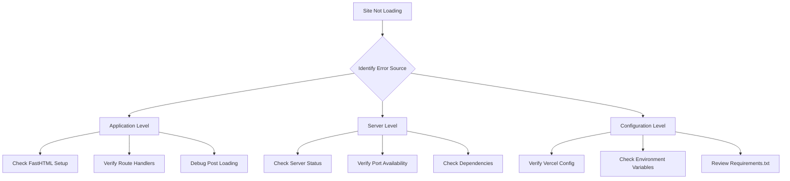

# Debugging Plan: Site Not Loading Issue

## Problem Statement
The website is not loading and showing a server error. This requires systematic investigation of multiple potential failure points.

## Identified Issues

### 1. Application Code Issues
- Typo in site description (main.py): "Insights feom political science research"
- Duplicate code block in blog.py get_post() function (lines 272-319 and 320-357)
- Post loading mechanism with broad exception handling may fail silently

### 2. Server Configuration
- Vercel configuration needs verification
- Python dependencies installation check required
- Port configuration verification needed

### 3. Content Loading System
- Posts directory existence and permissions check
- Markdown file formatting validation
- Post caching mechanism debugging

## Investigation Steps

1. **Application Level**
   - [ ] Fix typo in main.py site description
   - [ ] Clean up duplicate code in blog.py
   - [ ] Add better error handling and logging in post loading
   - [ ] Verify all route handlers are properly configured

2. **Server Level**
   - [ ] Check if all required dependencies are installed
   - [ ] Verify server process is running correctly
   - [ ] Validate port configuration
   - [ ] Review server logs for errors

3. **Configuration Level**
   - [ ] Review vercel.json settings
   - [ ] Verify environment variables
   - [ ] Check requirements.txt completeness
   - [ ] Validate file permissions

## Next Steps
1. Switch to debug mode for systematic implementation of fixes
2. Begin with application-level fixes as they're most likely to be the source
3. Add logging to track the request flow
4. Test each fix incrementally